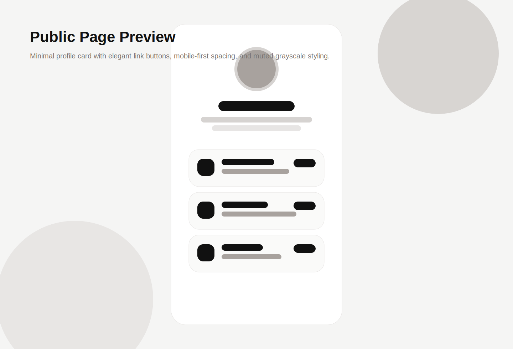
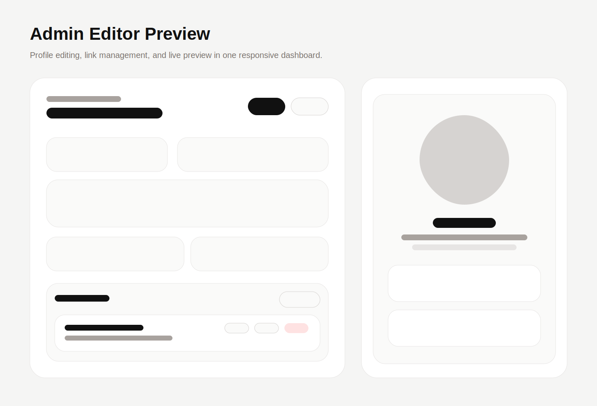

# Personal Linkboard

個人運用向けの Linktree 風リンクまとめアプリです。  
`Next.js + Tailwind CSS + SQLite` の最小構成で、公開ページと管理画面を 1 つのアプリにまとめています。

## Screenshots

### Public page



### Admin dashboard



## Features

- 公開用リンクページ
- 管理画面からプロフィールとリンクを編集
- 単一パスワードでログイン
- リンクの追加、編集、削除
- 表示/非表示の切り替え
- 並び順の変更
- テーマカラー、背景、角丸の調整
- ライブプレビュー
- SEO / OGP / favicon 対応

## Tech Stack

- Next.js 14
- React 18
- Tailwind CSS
- SQLite
- better-sqlite3
- bcryptjs
- lucide-react

## Project Structure

```text
app/
  admin/
  api/
  globals.css
  layout.js
  page.js
components/
  admin-editor.jsx
  public-link-page.jsx
lib/
  auth.js
  db.js
  validators.js
scripts/
  hash-password.mjs
```

## Getting Started

### 1. Install

```bash
npm install
```

### 2. Create env file

```bash
cp .env.example .env
```

### 3. Generate password hash

```bash
npm run db:hash-password -- your-strong-password
```

出力されたハッシュを `.env` の `ADMIN_PASSWORD_HASH` に設定してください。

`.env` の例:

```env
ADMIN_PASSWORD_HASH=$2b$10$replace_with_bcrypt_hash
SESSION_SECRET=replace-with-a-long-random-secret
NEXT_PUBLIC_SITE_URL=http://localhost:3000
```

### 4. Run dev server

```bash
npm run dev
```

アクセス先:

- Public page: `http://localhost:3000`
- Admin page: `http://localhost:3000/admin`

## Scripts

```bash
npm run dev
npm run build
npm run start
npm run lint
npm run db:hash-password -- your-password
```

## Authentication

- 管理画面は単一パスワード認証です
- パスワード本体は保存せず、bcrypt ハッシュのみを環境変数で保持します
- ログイン後は `HttpOnly Cookie` にセッションを保存します

## Database

- ローカル DB は `data.sqlite`
- 初回起動時にプロフィールとサンプルリンクを自動生成します

## Deployment

### Recommended for this MVP

SQLite のまま運用するなら次が向いています。

- Railway
- Render
- Fly.io

この MVP は `data.sqlite` をローカルファイルとして保持するため、最初の公開先は `Railway` が最も扱いやすいです。

### Railway

#### 1. Push repository to GitHub

このリポジトリを GitHub に push しておきます。

#### 2. Create a new Railway project

- Railway にログイン
- `New Project`
- `Deploy from GitHub repo`
- このリポジトリを選択

#### 3. Set environment variables

Railway の Variables に以下を設定します。

```env
ADMIN_PASSWORD_HASH=$2b$10$replace_with_bcrypt_hash
SESSION_SECRET=replace-with-a-long-random-secret
NEXT_PUBLIC_SITE_URL=https://your-domain.up.railway.app
```

#### 4. Build and start settings

通常は自動検出で動きます。必要なら以下を設定します。

- Build Command: `npm run build`
- Start Command: `npm run start`

#### 5. Persistent storage

SQLite を継続利用する場合、`data.sqlite` を消さない構成が必要です。  
Railway の volume を使う場合は、永続ディレクトリに DB を置くよう `lib/db.js` の保存先を変更してください。

現状の実装では:

```js
const dbPath = path.join(process.cwd(), "data.sqlite");
```

運用時に volume を使うなら、たとえば次のように変更します。

```js
const dbPath = process.env.DATABASE_PATH || path.join(process.cwd(), "data.sqlite");
```

そのうえで Railway の環境変数に:

```env
DATABASE_PATH=/data/data.sqlite
```

を設定し、`/data` を volume に割り当てます。

#### 6. Domain

- Railway の generated domain を使う
- 独自ドメインを使う場合は `NEXT_PUBLIC_SITE_URL` も同じ URL に更新

### Vercel

Vercel はローカル SQLite 永続化と相性がよくありません。  
本番で Vercel を使う場合は、`lib/db.js` を `Supabase` や `PostgreSQL` に差し替える構成がおすすめです。

#### Vercel で運用する場合の現実的な構成

- Frontend / API: Vercel
- Database: Supabase Postgres
- Auth: 現状の単一パスワード方式を維持

#### 差し替え方針

SQLite 依存はほぼ `lib/db.js` に閉じているので、ここを Supabase もしくは Postgres 用の実装に置き換えます。

置き換え対象:

- `getProfile`
- `updateProfile`
- `getLinks`
- `createLink`
- `updateLink`
- `deleteLink`
- `updateLinkOrder`

#### Vercel デプロイ手順

1. GitHub に push
2. Vercel で `New Project`
3. このリポジトリを import
4. Environment Variables を設定
5. Deploy

最低限必要な環境変数:

```env
ADMIN_PASSWORD_HASH=$2b$10$replace_with_bcrypt_hash
SESSION_SECRET=replace-with-a-long-random-secret
NEXT_PUBLIC_SITE_URL=https://your-app.vercel.app
```

Supabase を使う場合の追加例:

```env
SUPABASE_URL=https://xxxx.supabase.co
SUPABASE_SERVICE_ROLE_KEY=your-service-role-key
```

#### Important

現在のリポジトリは SQLite 版です。  
このまま Vercel に出しても、デプロイごとに DB 内容が保持されない可能性があります。

## Production Checklist

- `ADMIN_PASSWORD_HASH` を強いパスワードで生成する
- `SESSION_SECRET` を十分長いランダム文字列にする
- `NEXT_PUBLIC_SITE_URL` を本番 URL にする
- favicon URL と OGP 用プロフィール画像を設定する
- 初回デプロイ後に `/admin` へログインできるか確認する
- 管理画面で保存した内容が再起動後も残るか確認する

## Design Direction

- シンプル
- 上品
- 現代的
- モバイル優先
- 白 / 黒 / グレー基調 + アクセントカラー

## SEO / OGP

- `app/layout.js` で metadata を生成
- OGP title / description / image を設定
- favicon URL を管理画面から変更可能

## Future Improvements

- ドラッグ&ドロップ並び替え
- OGP 画像自動生成
- アクセス解析
- クリック数の記録
- テーマプリセット
- Supabase / Postgres 対応

## License

Private / personal use.
